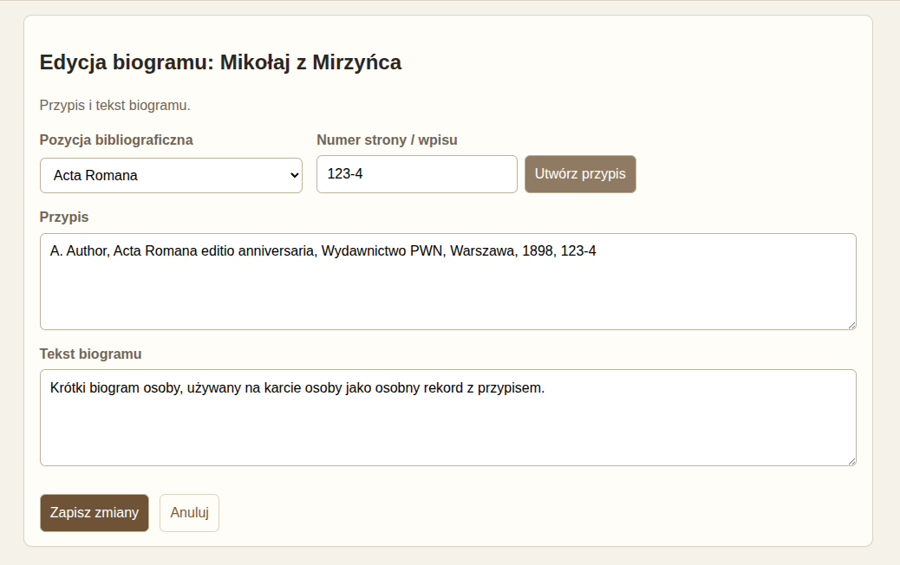
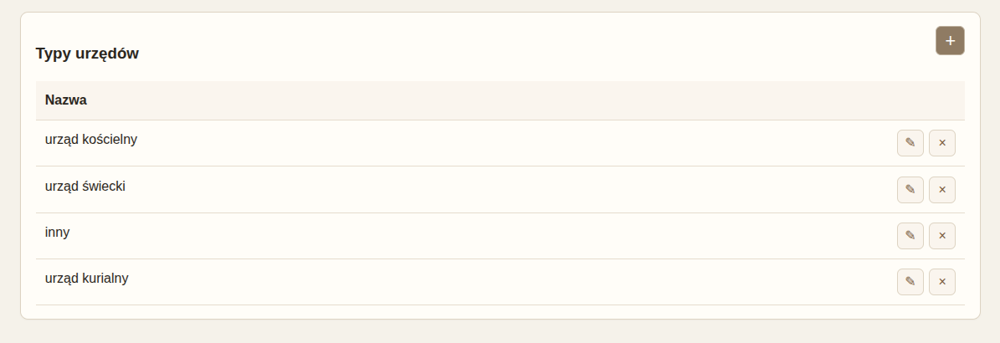

## 1. Do czego służy aplikacja

LegationesAdVaticanum to niewielka aplikacja bazodanowa służąca do gromadzenia, porządkowania i przeglądania materiałów dotyczących polskich poselstw do Stolicy Apostolskiej w XV wieku.

W aplikacji można rejestrować i opracowywać:

- osoby związane z poselstwami,
- poselstwa i ich podstawowe metadane,
- uczestników poselstw,
- literaturę przedmiotu,
- teksty źródłowe,
- motywy oznaczane w źródłach,
- słowniki pomocnicze wykorzystywane w formularzach.

## 2. Logowanie i uruchamianie

Po uruchomieniu aplikacji w przeglądarce pojawia się ekran logowania. Po zalogowaniu użytkownik ma dostęp do wszystkich modułów.

W prawym górnym rogu widoczna jest informacja o aktualnie zalogowanym użytkowniku oraz przycisk `Wyloguj`.

## 3. Układ aplikacji

Główne menu zawiera moduły:

- `Osoby`
- `Poselstwa`
- `Motywy`
- `Literatura`
- `Parametry`

Aktywny moduł jest wyróżniony w menu.

Na stronie głównej widoczne są:

- podstawowe statystyki,
- lista ostatnio dodanych osób,
- lista ostatnio odwiedzanych poselstw.

## 4. Oznaczenia i przyciski

W całej aplikacji stosowany jest spójny zestaw ikon:

- `+` — dodanie nowego rekordu lub nowego elementu w sekcji,
- `✎` — otwarcie edycji,
- `×` — usunięcie rekordu,
- ikona przy polu daty — ustawienie lub edycja daty historycznej.

Większość usunięć wymaga dodatkowego potwierdzenia.

## 5. Daty historyczne

Daty w aplikacji są obsługiwane przez osobne rekordy dat historycznych, użytkownik ustawia datę bezpośrednio przy konkretnych polach za pomocą formularza daty historycznej.

### 5.1. Jak ustawiać datę

Przy polach dat widoczna jest etykieta aktualnej daty oraz mały przycisk edycji. Kliknięcie otwiera okno daty historycznej.

W oknie daty można określić:

- typ daty (dokładna, około, przed, po),
- pewność (pewna, prawdopodobna, niepewna),
- etykietę: wyświetlaną formę daty (np. 'wiosna 1440'),
- zakres daty do sortowania i filtrowania (w formacie ISO: `YYYY-MM-DD`),
- komentarz.

Data może być też zakresem dat np. w przypadku braku pewności co do daty urodzin osoby można zapisać etykietę jako '1440-1442' zaś w zakresie dat do sortowania podać 1440-01-01 do 1442-12-31. 

### 5.2. Format daty do sortowania

Pola zakresu daty mają maskę `YYYY-MM-DD`. Myślniki pojawiają się automatycznie, a pola przyjmują tylko cyfry.

### 5.3. Ważna zasada

Z technicznego punktu widzenia daty zapisywane są w osobnej tabeli, data ustawiana przy konkretnym rekordzie jest traktowana jako data przypisana tylko do tego pola. 

## 6. Moduł Osoby

Moduł `Osoby` służy do rejestrowania osób związanych z poselstwami i Stolicą Apostolską.

### 6.1. Lista osób

Na liście osób można:

- filtrować rekordy tekstowo,
- filtrować po datach,
- sortować klikając w nagłówki tabeli,
- otwierać kartę osoby,
- usuwać osobę.

### 6.2. Filtrowanie osób

Filtrowanie tekstowe obejmuje między innymi:

- nazwę osoby,
- warianty nazw,
- wykształcenie,
- działalność osoby,
- urzędy i funkcje,
- biogramy.

Opcja `Filtrowanie dat` rozwija dodatkową sekcję z zakresem dat dla:

- daty urodzenia,
- daty śmierci.

### 6.3. Karta osoby

Karta osoby zawiera podstawowe dane oraz sekcje dodatkowe:

- `Warianty nazwy`
- `Udział w poselstwach`
- `Urzędy i funkcje`
- `Obecność przy Kurii`
- `Biogramy`
- `Działalność osoby`

Każda sekcja ma przycisk `+` do dodawania oraz ikony edycji i usuwania przy istniejących rekordach.

### 6.4. Edycja podstawowych danych osoby

Formularz osoby obejmuje między innymi:

- nazwę osoby,
- datę urodzenia,
- datę śmierci,
- wykształcenie,
- informacje dodatkowe.

### 6.5. Warianty nazw

Dla wariantu nazwy można określić:

- sam wariant,
- język wariantu.

### 6.6. Urzędy i funkcje

W formularzu urzędu lub funkcji można wprowadzić:

- nazwę urzędu,
- typ urzędu,
- daty początku i końca,
- deskrypcję źródłową,
- bibliografię,
- notę.

Typ urzędu wybiera się z listy słownikowej dostępnej w module `Parametry`.

### 6.7. Obecność przy Kurii

Sekcja służy do rejestrowania pobytów i obecności osoby przy Kurii Rzymskiej, z datami, miejscem, funkcją i notami.

### 6.8. Biogramy

Biogram zawiera:

- pozycję bibliograficzną,
- numer strony lub wpisu,
- przypis,
- tekst biogramu.

Przycisk `Utwórz przypis` może automatycznie zbudować przypis z danych bibliograficznych i numeru strony / wpisu.

### 6.9. Działalność osoby

Pole `Działalność osoby` znajduje się w osobnej zakładce na karcie osoby i służy do dłuższego, ciągłego opisu działalności badanej osoby.

## 7. Moduł Poselstwa

Moduł `Poselstwa` służy do opisu poselstw, ich uczestników, literatury oraz źródeł.

### 7.1. Lista poselstw

Na liście poselstw można:

- filtrować tekstowo,
- filtrować po datach,
- sortować po wybranych kolumnach,
- otwierać kartę poselstwa,
- usuwać poselstwo wraz z powiązaniami.

### 7.2. Filtrowanie poselstw

Filtrowanie tekstowe obejmuje między innymi:

- tytuł poselstwa,
- przedmiot misji,
- opis poselstwa,
- nazwiska uczestników.

Sekcja `Filtrowanie dat` pozwala filtrować po zakresie wybranej daty:

- data mianowania,
- data dotarcia do Rzymu,
- data audiencji,
- data wyjazdu z Rzymu,
- data powrotu do Polski.

### 7.3. Karta poselstwa

Karta poselstwa pokazuje:

- podstawowe metadane,
- uczestników,
- literaturę,
- źródła.

### 7.4. Edycja poselstwa

Formularz poselstwa obejmuje:

- tytuł,
- rok,
- przedmiot misji,
- daty kluczowych etapów poselstwa,
- opis.

### 7.5. Uczestnicy poselstwa

W formularzu uczestnika można określić:

- osobę,
- rolę w poselstwie,
- oficjalny urząd pełniony w czasie poselstwa, np. kanonik, starosta
- deskrypcję źródłową łacińską,
- deskrypcję źródłową polską,
- notę.

Lista urzędów w czasie poselstwa zależy od wybranej osoby.

### 7.6. Literatura poselstwa

Do poselstwa można przypisać pozycje literatury. W formularzu można wskazać:

- opracowanie,
- numer strony lub zakres stron,
- komentarz.

Po wyborze opracowania pod polem pojawia się informacja pomocnicza z pełnym tytułem i rokiem wydania.

Na karcie poselstwa kafelek literatury pokazuje:

- skrót,
- tytuł,
- rok wydania,
- stronę,
- komentarz.

### 7.7. Źródła

Źródła są jednym z najważniejszych elementów modułu poselstw.

Każde źródło może zawierać:

- typ źródła,
- sygnaturę oryginalną,
- edycję,
- tekst oryginalny,
- tekst polski,
- notę.

## 8. Karta źródła

Karta źródła służy do pracy z tekstem źródłowym i oznaczaniem motywów.

### 8.1. Równoległy układ tekstów

Tekst oryginalny i tekst polski są automatycznie dzielone na akapity. Na karcie źródła oba teksty są pokazywane równolegle, akapit do akapitu.

### 8.2. Edycja źródła

Formularz źródła służy do wprowadzania i poprawiania metadanych oraz pełnych tekstów.

### 8.3. Oznaczanie motywów

Na karcie źródła można zaznaczać fragmenty tekstu w obrębie akapitu i przypisywać im motywy.

Podczas dodawania oznaczenia użytkownik wybiera:

- motyw,
- notę do oznaczenia.

Zakres znaku, język i akapit są rozpoznawane automatycznie.

## 9. Moduł Motywy

Moduł `Motywy` służy do pracy ze słownikiem motywów oraz do przeglądania wszystkich oznaczeń przypisanych do danego motywu.

### 9.1. Lista motywów

Na liście motywów można:

- dodawać nowe motywy,
- edytować istniejące,
- usuwać motywy,
- przeglądać liczbę oznaczeń.

### 9.2. Formularz motywu

Motyw ma własne dane:

- nazwę,
- kolor,
- opis.

Kolor wybiera się przyjaznym selektorem koloru.

### 9.3. Karta motywu

Karta motywu pokazuje listę wszystkich oznaczeń tego motywu w źródłach. Dla każdego oznaczenia widoczne są:

- poselstwo,
- edycja,
- sygnatura,
- numer akapitu,
- fragment tekstu,
- nota do oznaczenia.

Można też otworzyć modalny podgląd akapitu źródła z kolorowaniem oznaczeń.

## 10. Moduł Literatura

Moduł `Literatura` jest wspólną bazą pozycji bibliograficznych używanych w innych częściach aplikacji.

### 10.1. Lista literatury

Na liście literatury można:

- filtrować po skrócie, autorze, tytule i innych danych,
- dodawać nowe pozycje,
- edytować pozycje,
- usuwać pozycje nieużywane.

### 10.2. Formularz pozycji bibliograficznej

Formularz obejmuje między innymi:

- typ opracowania,
- skrót,
- autora,
- redaktora,
- tytuł,
- miejsce wydania,
- wydawnictwo,
- tom lub wolumin,
- serię,
- rok wydania,
- dostęp,
- notę.

## 11. Moduł Parametry

Moduł `Parametry` przechowuje słowniki wykorzystywane w formularzach.

Obecnie można tam zarządzać między innymi:

- typami źródeł,
- typami urzędów.

Każdy słownik pozwala:

- dodawać nowe wartości,
- edytować istniejące,
- usuwać nieużywane wpisy.

## 12. Zasady pracy i bezpieczeństwo danych

Podczas codziennej pracy warto pamiętać o kilku zasadach:

- regularnie wykonywać kopie zapasowe bazy,
- przed zamknięciem aplikacji upewnić się, że dane w bieżącym formularzu zostały zapisane,
- ostrożnie usuwać rekordy, ponieważ część usunięć obejmuje także powiązane dane (np. usunięcie poselstwa usuwa też przypisanych uczestników (ale nie osoby z tabeli osób!), czy teksty źródeł),

Wszystkie dane przechowywane są w bazie SQLite, znajdującej się w pliku:

`instance/poselstwa.sqlite`

Najważniejszym elementem kopii zapasowej powinien być właśnie ten plik.
